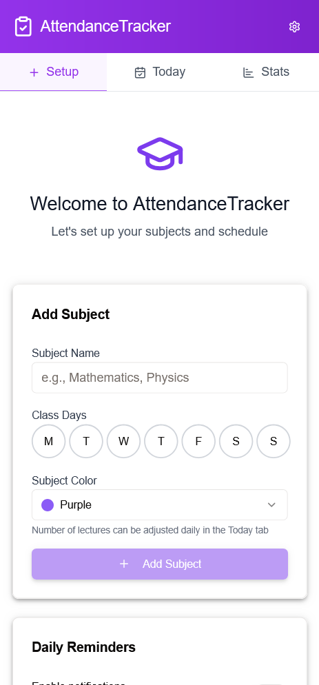
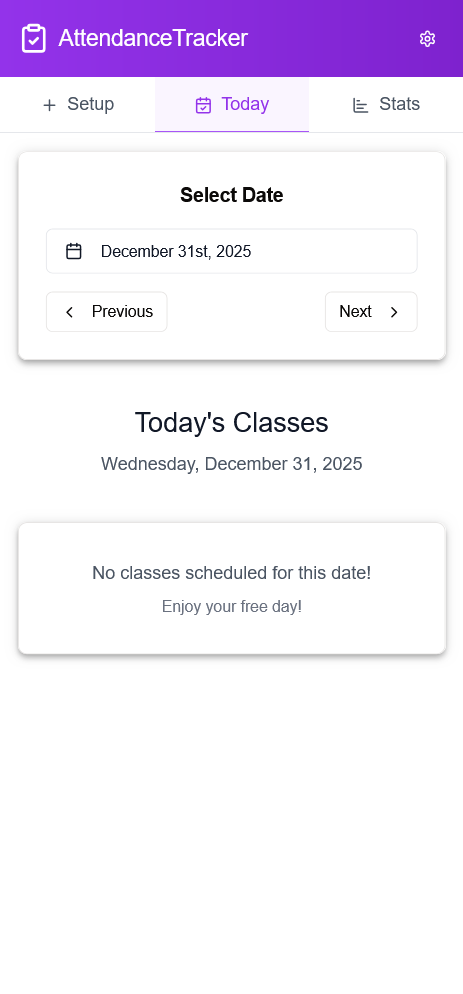
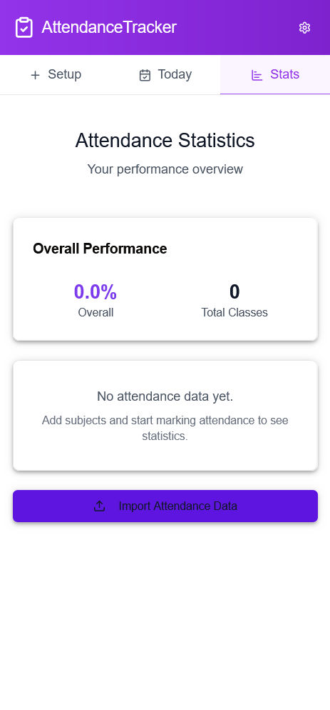

# Attendance Record App

A small attendance tracking app built with Vite + React + TypeScript.

## Features

- Track daily attendance
- Create lectures and mark attendance
- Mobile-friendly UI

## Screenshots

Home screen:



Daily attendance:



Lecture attendance:



## Run locally

Prerequisites: Node.js (16+), npm

Install and start dev server:

```bash
npm install
npm run dev
```

## Build for production

```bash
npm run build
```

## Build for Android (Capacitor)

Prerequisites: Android Studio with SDK, Java JDK, and Node.js.

1. Build the web assets:

```bash
npm run build
```

2. Add/sync the Capacitor Android platform and open Android Studio:

```bash
# (only if the platform hasn't been added yet)
npx cap add android

# copy web assets and sync plugins
npx cap sync android

# open the Android project in Android Studio
npx cap open android
```

3. From Android Studio: select a device/emulator and Run the app (or use Gradle tasks to assemble/install).

Notes:
- If you encounter Android SDK or JDK errors, ensure `ANDROID_HOME`/`JAVA_HOME` are set and Android Studio's SDK is installed.
- Use `npx cap copy` after quick web changes, or `npx cap sync` to update plugins and platforms.

## Notes

- The app source is in the `client/` folder.
- Server code is in `server/`.